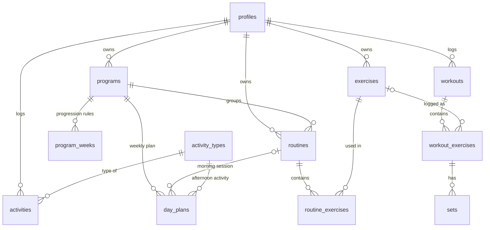

# Data model

Weights are stored in **kg**. Weekdays use `0 = domingo … 6 = sábado` (same as JavaScript `Date.getDay()`).
Every user-owned table is protected by row level security: a signed-in user only ever reads and writes their own rows.

## Tables

| Table | What it holds |
|---|---|
| `profiles` | Name, units (kg/lb), default rest, theme, rest alert, daily goal, timezone. One row per user. |
| `activity_types` | Shared catalogue: natación, caminata, pilates, spinning, entrenamiento funcional. |
| `exercises` | Your exercise library: Spanish name, muscle group, equipment, **Hevy name**, compound flag, form cues, optional video link. |
| `programs` | A training block, e.g. *Body recomp · 4 semanas*, with start date and length. One active per user. |
| `program_weeks` | The progression as data: tip, extra sets for compound lifts (week 3), rep target for compound lifts (week 4), suggested weight bump (week 2). |
| `day_plans` | Each weekday in the program: morning label/routine and afternoon activity (natación, optional on Saturday). |
| `routines` / `routine_exercises` | Lower A, Upper A, Lower B, Upper B and their exercises: sets, reps, per side, rest, starting weight. |
| `workouts` | Each gym session: routine name snapshot, program week, start/end, duration (calculated), status, notes. Only one can be *in progress*. |
| `workout_exercises` | Exercises done in a session (name snapshot, targets, skipped, notes). |
| `sets` | Weight, reps, completed + time. |
| `activities` | Non-gym activity: type, date, minutes, notes. |

## Views and functions

| Name | Answers |
|---|---|
| `v_last_performance` | "What did I lift last time?" per exercise. |
| `v_personal_records` | Heaviest set ever per exercise. |
| `v_exercise_sessions` | Every logged exercise with top set, volume and a summary like `12×12 · 12×12 · 14×10`. |
| `v_active_days` | Every day with gym or another activity — drives the daily goal. |
| `v_routine_summary` | Exercise count and estimated minutes per routine. |
| `program_week(program, date)` | 0 = not started, 1–4, >4 = finished. |
| `activity_streak()` | Consecutive active days (today counts once you log something). |
| `seed_my_program(start)` | Creates the body recomp program for the signed-in user. |

## How it maps to the app's local data

The prototype keeps one JSON object in `localStorage` (`training-os/v1`). Its shape lines up with the tables:

| App JSON | Table |
|---|---|
| `profile` | `profiles` |
| `program`, `program.tips`, `program.weekPlan` | `programs`, `program_weeks`, `day_plans` |
| `exercises[]` | `exercises` (`id` → `slug`) |
| `routines[]`, `routines[].exercises[]` | `routines`, `routine_exercises` |
| `workouts[]`, `.exercises[]`, `.sets[]` | `workouts`, `workout_exercises`, `sets` |
| `activities[]` | `activities` |
| `active` (workout in progress) | a `workouts` row with `status = 'in_progress'` |
